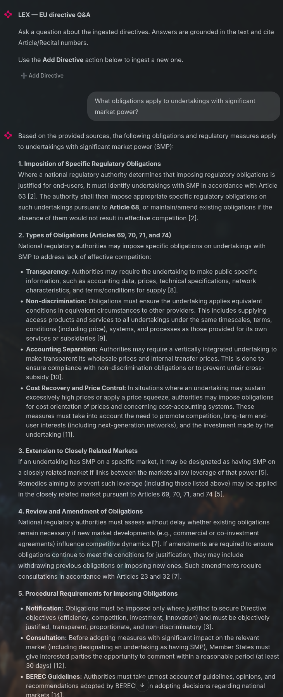
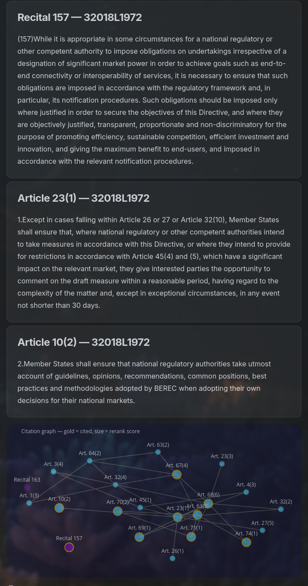
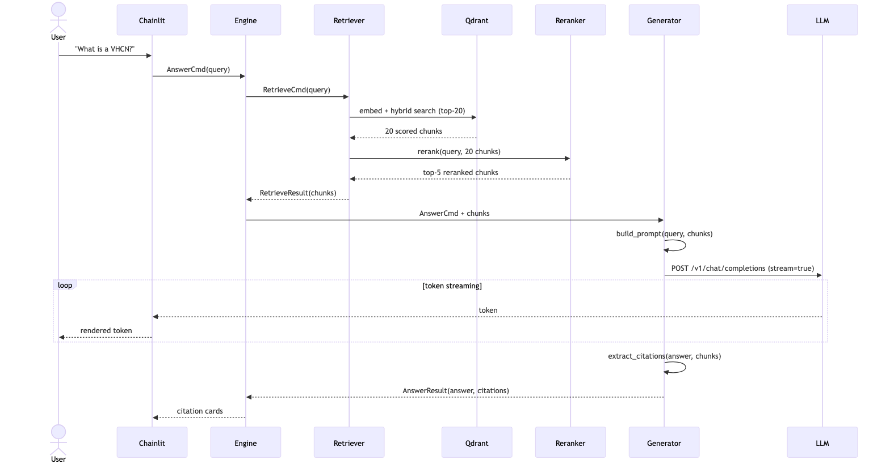

# LEX

Local-first legal RAG over EU directives, with Article-level citations and
source graph traversal.

[](https://opensource.org/licenses/MIT)
[](https://www.python.org/downloads/)
[](https://github.com/spartacoos/LEX/actions/workflows/ci.yml)

LEX lets you ask natural-language questions over dense EU legislation and get
grounded answers backed by specific Articles, Recitals, and citation links.

```bash
uv run lex ask "What is the purpose of the European Electronic Communications Code?"
```

```text
A: The European Electronic Communications Code establishes a harmonised
framework for the regulation of electronic communications networks,
electronic communications services, associated facilities, and associated
services in the Union. It sets out tasks for national regulatory authorities
and other competent authorities, and creates procedures to ensure consistent
application of the regulatory framework throughout the internal market.

Sources: Art. 1(1) · Art. 1(2) · Art. 3(1)
```

## UI

| Ask and answer | Citations and source graph |
|:---:|:---:|
|  |  |

The chat interface answers legal questions with source-backed citations. The
citation panel and graph expose where the answer came from and how the cited
parts of the directive relate to one another.

## Why LEX exists

EU directives are cross-referenced documents. Definitions, obligations,
exceptions, and operative scope are often spread across Articles, Recitals,
and referenced instruments.

LEX treats legal answering as a retrieval problem first and a generation problem
second: retrieve the relevant legal text, rerank it, traverse citation links,
then generate an answer grounded in the selected sources.

## What it does

- Answers questions over EU directives
- Grounds answers in Article-level and Recital-level citations
- Uses hybrid dense/BM25 retrieval, reranking, HyDE, and citation graph traversal
- Runs locally with quantised models, Qdrant, Redis, FastAPI, and Chainlit
- Exposes one typed engine through CLI, API, UI, worker, and tests

## How it works

```text
query
  │
  ├─ classify (definition / procedural / negative / general)
  │
  ├─ HyDE expansion via LLM          [skipped for definition + negative]
  │    "What would a directive say to answer this?"
  │
  ├─ BGE-M3 dense embed (1024-dim CLS)
  ├─ BM25 sparse (IDF-weighted, same tokenizer vocabulary)
  │
  ├─ Qdrant hybrid search, RRF fusion → top-20 candidates
  │
  ├─ BGE-reranker-v2-m3 cross-encoder → top-5
  │    + chunk-type boost (article 1.0 · recital 0.85)
  │    + one-hop citation graph traversal
  │
  ├─ RAG prompt → LLM → streaming answer
  │
  └─ two-stage retrieval: extract article refs from draft
       → fetch missing articles → regenerate if context enriched
```

Every entry point, including CLI, API, UI, tests, and workers, builds a typed
`Command` and submits it to a central `Engine`. Handlers are pure functions
with explicit typed I/O. The entire system contract fits in one file
(`commands.py`). Adding a new operation means adding one handler file and one
routing case.

For a detailed account of non-trivial decisions, see
[`ENGINEERING_REPORT.md`](ENGINEERING_REPORT.md).

## Answer flow



## Ingestion state machine

```text
              ┌─────────┐
   IngestCmd  │         │
  ───────────►│ Queued  │  (status stored in Redis)
              │         │
              └────┬────┘
                   │ worker picks up
              ┌────▼────┐
              │Fetching │──── network error ────┐
              └────┬────┘                       │
                   │ XML received               │
              ┌────▼────┐                       │
              │ Parsing │──── malformed XML ────┤
              └────┬────┘                       │
                   │ nodes extracted            │
              ┌────▼────┐                       │
              │Chunking │                       │
              └────┬────┘                       │
                   │ chunks created             │
              ┌────▼──────┐                     │
              │ Embedding │                     │
              └────┬──────┘                     │
                   │ vectors computed           │
              ┌────▼────┐                       │
              │ Writing │──── Qdrant error ─────┤
              └────┬────┘                       │
                   │ stored                 ┌───▼────┐
              ┌────▼────┐                   │ Failed │
              │  Done   │                   └────────┘
              └─────────┘
        (pub/sub notification)
```

## Prerequisites

| Requirement | Notes |
|---|---|
| Python 3.12+ | Managed by `uv`, no manual install needed |
| [uv](https://docs.astral.sh/uv/getting-started/installation/) | `curl -LsSf https://astral.sh/uv/install.sh \| sh` |
| Docker + Compose v2 | Qdrant vector DB and Redis job queue |
| NVIDIA GPU, 8 GB VRAM | Recommended. CPU fallback available. |
| NVIDIA Container Toolkit | Linux GPU + Docker production path only |

Docker Compose v2 ships with Docker Desktop. On Ubuntu with `docker.io`:

```bash
sudo mkdir -p /usr/local/lib/docker/cli-plugins
sudo curl -SL https://github.com/docker/compose/releases/latest/download/docker-compose-linux-x86_64 \
  -o /usr/local/lib/docker/cli-plugins/docker-compose
sudo chmod +x /usr/local/lib/docker/cli-plugins/docker-compose
```

## Installation

```bash
git clone https://github.com/spartacoos/LEX.git && cd LEX

# Pick ONE extra matching your platform:
uv sync --extra llm-mlx           # macOS Apple Silicon
uv sync --extra llm-llamacpp      # Linux + NVIDIA GPU
uv sync --extra llm-llamacpp-cpu  # Linux CPU-only / WSL

# Linux/WSL: expose venv CUDA libraries, once per shell
source scripts/env.sh
```

## Configuration

```bash
uv run lex config                  # interactive wizard, writes .env
uv run lex config --list           # show available profiles
uv run lex config --profile qwen35-9b-gpu --judge gemma4-31b-gpu
```

Profiles live in `profiles/*.yaml`. Each encodes a hardware/model
combination. Adding a new model means adding a new YAML file.

| Profile | Model | VRAM | Notes |
|---|---|---:|---|
| `gemma4-e2b-cpu` | Gemma 4 E2B Q4 | CPU | Works everywhere |
| `gemma4-e2b-gpu` | Gemma 4 E2B Q4 | 4 GB | Fastest GPU option |
| `gemma4-e4b-gpu` | Gemma 4 E4B Q4 | 8 GB | Recommended default |
| `gemma4-e4b-mlx` | Gemma 4 E4B 4bit | Metal | Recommended on Mac |
| `gemma4-31b-gpu` | Gemma 4 31B Q4 | 24 GB | Best quality local |
| `qwen35-9b-gpu` | Qwen 3.5 9B Q4 | 8 GB | Strong reasoning |
| `remote-openai` | Any remote model | N/A | OpenAI / Together / Groq |

Individual settings can be overridden without touching the profile:

```bash
LEX_LLM__N_GPU_LAYERS=10 uv run lex serve-llm   # partial GPU offload
LEX_LLM__CTX_SIZE=4096   uv run lex serve-llm   # reduce if OOM
```

## Running

Three long-running processes, three terminals:

```bash
# Terminal 1: embedding + reranker models, loaded once and served continuously
uv run lex serve-models
uv run lex serve-models --reranker-device cuda   # if VRAM is free

# Terminal 2: LLM
uv run lex serve-llm
uv run lex serve-llm --profile qwen35-9b-gpu     # override profile
uv run lex serve-llm --gpu-layers 0              # force CPU

# Terminal 3: services, ingestion, and UI
docker compose up -d
uv run lex services              # verify all three are healthy
uv run lex ingest 32018L1972     # ingest the EECC, about 6 min on CPU
uv run lex ui                    # http://localhost:8100
```

## CLI reference

```text
lex config [--profile P] [--judge P] [--list]
lex serve-models [--embedding-device D] [--reranker-device D]
lex serve-llm [--profile P] [--port N] [--gpu-layers N] [--ctx-size N]
lex services               health-check all dependencies
lex smoke                  verify config, print sample commands
lex ingest <CELEX_ID> [--language en] [--source cellar|local]
lex search "<query>" [--top-k N] [--celex-id X] [--article N]
lex ask "<question>" [--celex-id X] [--article N]
lex serve [--host H] [--port N]     FastAPI server
lex worker                          Redis ingestion worker
lex ui [--port N]                   Chainlit chat UI
```

## Evaluation

```bash
# Fast: one model for both RAG and judging
uv run pytest -m eval -v

# Recommended: dedicated judge model
# Terminal 1: RAG LLM on port 8080, already running
uv run lex serve-llm --profile gemma4-31b-gpu --port 8081  # terminal 2

export LEX_EVAL_JUDGE__BASE_URL=http://localhost:8081/v1
export LEX_EVAL_JUDGE__MODEL=gemma-4-31b-it
uv run pytest -m eval -v          # terminal 3

# Remote judge, fastest
export LEX_EVAL_JUDGE__BASE_URL=https://api.openai.com/v1
export LEX_EVAL_JUDGE__MODEL=gpt-4o-mini
export OPENAI_API_KEY=sk-...
uv run pytest -m eval -v
```

Reports are written to `tests/reports/eval-YYYYMMDD-HHMMSS.{csv,md}`.

### Results

The table below shows two recent eval runs. The targets are aspirational for
a quantised local model. A 31B or API-backed model is expected to improve the
structured citation and faithfulness metrics.

| Metric | Target | Qwen 3.5 9B (29 q) | Gemma 4 E4B (24 q) | Readout |
|---|---:|---:|---:|---|
| context_precision | > 0.80 | 0.574 | 0.827 | Gemma retrieves more tightly |
| context_recall | > 0.80 | 0.897 | 0.792 | Qwen retrieves more broadly |
| faithfulness | > 0.90 | 0.802 | 0.814 | below target |
| answer_relevancy | > 0.85 | 0.902 | 0.977 | strong |
| citation_correctness | > 0.90 | 0.514 | 0.505 | main bottleneck |

These results are strong for a local 9B-class setup. Qwen 3.5 9B reaches high
context recall and answer relevancy, which means the retrieval pipeline is
usually finding the right legal material and the generated answer usually
addresses the question asked. Gemma 4 E4B trades some recall for higher
precision, retrieving a tighter context set.

The main weakness is citation completeness, not retrieval availability. The
expected answers for some cross-reference questions require citing many
Articles at once. The relevant content is often present in the retrieved
context, but smaller models struggle to extract and format the full expected
set of references reliably.

The hardest category is broad cross-reference enumeration, for example
questions like "Which articles concern end-user rights?" where the expected
answer spans a whole Title. This is where larger models and deeper citation
graph traversal should help most.

For a quantised model running on consumer hardware, the current profile is
already useful: high recall, strong answer relevancy, explicit citations, and
a path to improve faithfulness and citation correctness by changing model
profile rather than changing the core architecture.

## Type checking

```bash
uvx ty check src/lex/       # zero errors expected
```

Configuration lives in `ty.toml`. The type checker catches undefined names,
missing imports, and incorrect argument types across the pipeline before
runtime. This is the class of error that caused `RetrieveFilter` and
`_chunk_uuid` to surface as runtime failures during development.

## Adding a new feature

1. Add a variant to `Command` in `commands.py`
2. Write a handler `handle_<name>(cmd, deps) -> Result`
3. Add a routing case in `engine.py`
4. Add a CLI command in `cli.py` that builds the command and calls `engine.submit`

Existing handlers do not need to be modified.

## Repository layout

```text
profiles/           Hardware/model profiles (YAML)
src/lex/
  commands.py       System contract: all Command + Result types
  engine.py         Dispatcher
  config.py         Settings (pydantic-settings, profile-aware)
  profile.py        YAML profile loader
  sources.py        EUR-Lex CELLAR fetcher + local file adapter
  ingestion.py      Parse → chunk → embed → write
  retrieval.py      Hybrid search + rerank + citation graph
  generation.py     HyDE + RAG prompt + two-stage retrieval
  model_server.py   Unix-socket model daemon
  worker.py         Redis ingestion queue consumer
  api.py            FastAPI + SSE streaming
  cli.py            typer CLI
  ui.py             Chainlit chat UI + Plotly citation graph
  tracing.py        Langfuse shim (no-op when unconfigured)
tests/
  test_lex.py       Smoke tests + parametrised eval
  conftest.py       CSV/Markdown report writer
  gold_standard.json  30 curated Q/A pairs
ENGINEERING_REPORT.md   Design decisions, failure modes, limitations
```

## Known limitations and future work

**Corpus boundaries.** The EECC references other instruments, including the
BEREC Regulation, ePrivacy Directive, and Directive 2014/61/EU, for key
definitions and obligations. Questions whose answers live in those instruments
receive partial answers or grounded refusals. Each additional instrument is a
single `lex ingest <CELEX_ID>` away.

**Annexes not ingested.** The EECC's technical annexes live in separate CELLAR
DOC files. The current fetcher retrieves the main act only (`DOC_2`).

**Temporal validity.** LEX indexes a specific version of a directive.
Amendments are not tracked yet.

**HyDE quality is model-dependent.** The query expansion step that bridges
vocabulary gaps, for example "SMP" to "significant market power", works well
with Qwen 3.5 9B but degrades with smaller models. A validity guard catches and
discards bad expansions, falling back to the original query.

**Reranker latency on CPU.** With an 8 GB GPU fully occupied by the LLM, the
reranker runs on CPU, about 5 seconds per query. Moving to a larger GPU or a
smaller LLM resolves this.

Planned improvements, in priority order:

1. Annex ingestion: fetch all DOC files, not just `DOC_2`
2. Corpus expansion: BEREC Regulation, ePrivacy, Directive 2014/61/EU
3. Full directive graph UI: persistent sidebar showing the complete article
   cross-reference network
4. Amendment tracking: fetch consolidated versions by date

## Troubleshooting

**`libcudart.so.12: cannot open shared object file`**

Run `source scripts/env.sh` before any `uv run` command on Linux.

**`LLM endpoint unreachable`**

Run `uv run lex serve-llm` in a separate terminal first.

**`Model server not running`**

Run `uv run lex serve-models` in a separate terminal. Without it, each CLI
command cold-starts the embedding models, adding about 9 seconds of overhead.

**`CUDA out of memory` on serve-models**

The GPU is fully occupied by the LLM. Run `uv run lex serve-models` without
`--reranker-device cuda`. CPU is the safe default.

**`Evaluation LLM outputted an invalid JSON`**

The judge model is too small. Use a 13B+ model or a remote API.

**`docker compose not found` on Ubuntu with `docker.io`**

See the Docker Compose v2 install snippet in [Prerequisites](#prerequisites).

**`hf: command not found`**

```bash
uv pip install huggingface_hub[cli]
```

**`llama-cpp-python fails to install`**

Try `uv sync --extra llm-llamacpp-cpu` first to verify the environment, then
switch to `uv sync --extra llm-llamacpp`.

## License

MIT License. See [LICENSE](LICENSE).
