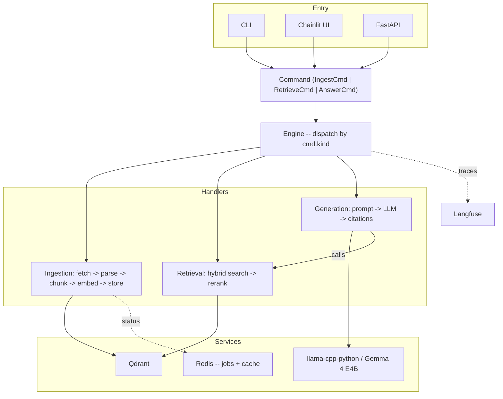
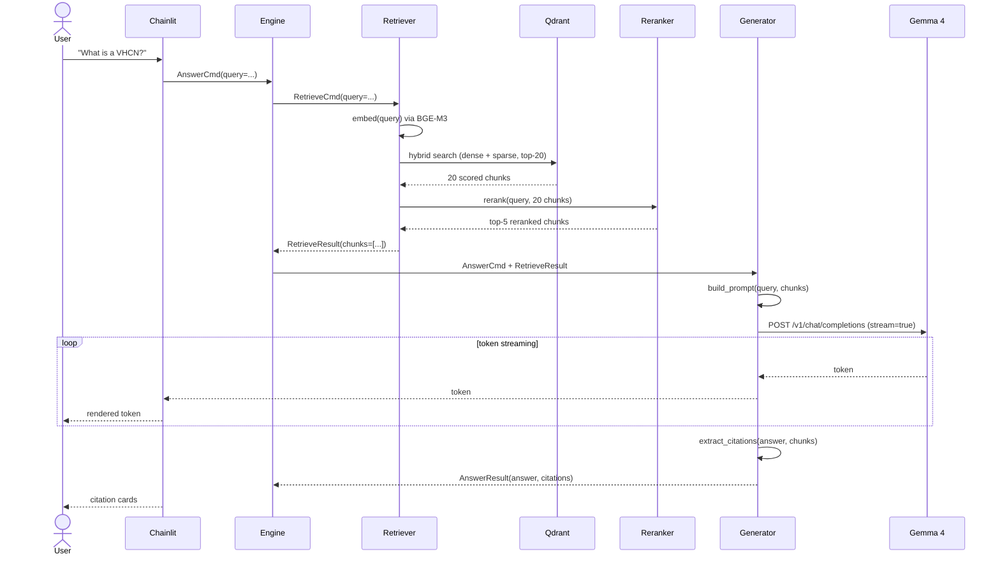
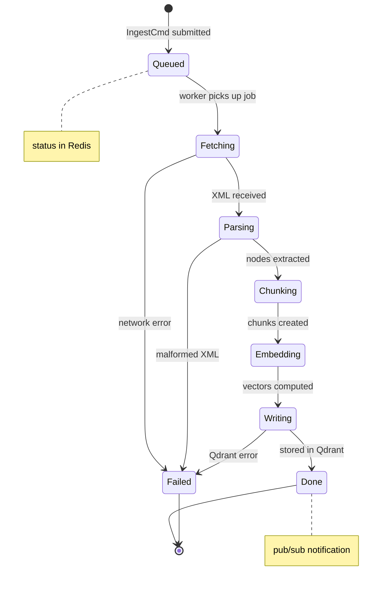

# LEX: Natural Language Interface for EUR-Lex Directives

## Project Specification v1.1

---

## 1. Problem

EU directives on EUR-Lex are dense legal documents (100-200 pages) with
rigid hierarchical structure. Users need plain-language Q&A with grounded,
citation-backed answers from these documents.

Initial target: Directive (EU) 2018/1972, the European Electronic
Communications Code (EECC), CELEX ID `32018L1972`. ~180 pages, telecoms
regulation, available in 24 EU languages.

The system is local-first, reproducible (uv + docker), incrementally
deployable to cloud, and extensible to new directives and languages with
near-zero code changes.


## 2. Data: EUR-Lex and Formex XML

The EU Publications Office operates CELLAR, a repository storing all
EUR-Lex content. We access it via REST API: a GET request against the
CELEX URI with content negotiation retrieves documents in Formex XML,
HTML, or PDF. No authentication required for public documents.

Formex XML is the canonical structured format. Its hierarchy maps directly
to our chunking boundaries:

```
<ACT>
  <PREAMBLE>
    <GR.CONSID>
      <CONSID>                -- recitals: (1), (2), ...
  <ENACTING.TERMS>
    <PART>
      <TITLE>
        <CHAPTER>
          <ARTICLE>
            <PARAG>           -- numbered paragraphs
  <ANNEX>
```

This structure preserves article numbers, paragraph numbers, and cross-
reference targets -- metadata lost in HTML/PDF. Always prefer Formex.
Fall back to HTML only when Formex is unavailable (pre-2014 documents).

Each legal act also has a persistent ELI URI stored as chunk metadata:
`http://data.europa.eu/eli/dir/2018/1972/oj`


## 3. Architecture

### 3.1 Design Philosophy

Command-buffer dispatch, inspired by GPU command queues:

- Every entry point (CLI, UI, API, tests) builds a typed Command and
  submits it to the Engine.
- The Engine routes by command kind to a handler.
- Handlers have explicit sync/async contracts and typed I/O.
- Subsystems never import each other; they communicate only through
  the command/result types.

We use algebraic data types (discriminated unions via Pydantic) and
explicit state machines where state transitions matter (ingestion jobs).
The goal is Haskell-like reasoning: if it type-checks, it works.

### 3.2 System Diagram



### 3.3 Sequence Diagram (Answer Flow)

This is the hot path -- what happens when a user asks a question:



### 3.4 State Diagram (Ingestion Job)

Ingestion is the only long-running operation. It follows an explicit
state machine so the UI can show progress and the system can recover
from failures:



Each state transition publishes to Redis pub/sub so the UI can render
a live progress indicator. The job's current state + metadata is stored
as a Redis hash keyed by `cmd_id`.


## 4. Technology Stack

| Concern            | Choice                  | Why                                  |
|--------------------|-------------------------|--------------------------------------|
| Deps               | uv                      | Deterministic, fast                  |
| Containers         | docker compose          | Reproducible, identical dev/prod     |
| Config             | pydantic-settings       | Typed, env-backed                    |
| Types/commands     | pydantic v2             | Discriminated unions, validation     |
| XML parsing        | lxml                    | XPath over Formex, fast              |
| Embeddings         | sentence-transformers   | BGE-M3, multilingual, in-process     |
| Reranking          | sentence-transformers   | BGE-reranker-v2-m3, cross-encoder    |
| Vector store       | Qdrant                  | Hybrid search, metadata filters      |
| LLM                | llama-cpp-python        | Gemma 4 E4B Q4_K_M, OpenAI API      |
| Queue/cache        | Redis                   | Job state machine, result cache      |
| HTTP               | httpx                   | Async, for CELLAR + LLM calls        |
| API                | FastAPI                 | Async, OpenAPI schema                |
| UI                 | Chainlit                | Streaming, citations, sidebar forms  |
| CLI                | typer                   | Subcommands, quick verification      |
| Logging            | structlog               | Structured, correlation IDs          |
| Tracing            | Langfuse (self-hosted)  | Optional; falls back to structlog    |
| Eval               | DeepEval + pytest       | pytest-native, RAGAS-compat metrics  |


## 5. Command Types

```python
# Discriminated union -- the entire system contract in ~60 lines

Command = IngestCmd | RetrieveCmd | AnswerCmd

class IngestCmd(BaseModel):
    kind: Literal["ingest"] = "ingest"
    cmd_id: UUID = Field(default_factory=uuid4)
    celex_id: str               # "32018L1972"
    source: Literal["cellar", "local"] = "cellar"
    language: str = "en"

class RetrieveCmd(BaseModel):
    kind: Literal["retrieve"] = "retrieve"
    cmd_id: UUID = Field(default_factory=uuid4)
    query: str
    top_k: int = 5
    filters: RetrieveFilter = Field(default_factory=RetrieveFilter)

class AnswerCmd(BaseModel):
    kind: Literal["answer"] = "answer"
    cmd_id: UUID = Field(default_factory=uuid4)
    query: str
    filters: RetrieveFilter = Field(default_factory=RetrieveFilter)
    stream: bool = False

class RetrieveFilter(BaseModel):
    celex_id: str | None = None
    article: str | None = None
    language: str = "en"
```

Result types mirror each command with typed outputs. Every command
carries a UUID for correlation across logs, traces, and Redis.


## 6. Chunking Strategy

EU directives have natural chunk boundaries. We exploit them:

1. Parse Formex XML into structural nodes via XPath.
2. Each Article becomes a chunk. If Article > 1500 chars, split at
   Paragraph boundaries. If Paragraph > 1500 chars, split at sentence
   boundaries with 2-sentence overlap.
3. Recitals are separate chunks, linked to articles via metadata.
4. Each chunk carries full ancestry: `{celex_id, eli_uri, language,
   part, title, chapter, article, paragraph, chunk_type}`.

Collection naming: `eurlex_{lang}_{version}` (e.g. `eurlex_en_v1`).
Versioned collections enable A/B comparison when changing strategies.


## 7. Project Structure (~12 files)

```
LEX/
  pyproject.toml               # uv-managed, single dependency list
  docker-compose.yml           # Qdrant, Redis, Langfuse, LLM
  Dockerfile                   # App image
  .env                         # Config overrides
  SPEC.md                      # This document
  README.md

  src/lex/
    __init__.py
    config.py                  # pydantic-settings (~60 lines)
    commands.py                # All command + result types (~150 lines)
    engine.py                  # Dispatcher + telemetry (~80 lines)
    sources.py                 # Source protocol + CellarRest + LocalFile (~150 lines)
    ingestion.py               # parse + chunk + embed + write + handler (~400 lines)
    retrieval.py               # hybrid search + rerank + handler (~250 lines)
    generation.py              # prompt + LLM client + citation extraction (~300 lines)
    worker.py                  # Redis queue consumer for ingestion (~100 lines)
    api.py                     # FastAPI app + routes (~150 lines)
    cli.py                     # typer subcommands (~100 lines)
    ui.py                      # Chainlit app (~150 lines)

  tests/
    test_lex.py                # Single test file: integration + eval (~200 lines)
    gold_standard.json         # 30-50 curated Q/A pairs
```

Total: ~12 source files, ~1900 lines of application code.

Each file is a self-contained module. `ingestion.py` contains the parser,
chunker, embedder, writer, and the ingestion handler -- everything needed
to understand how a directive goes from XML to vectors. You can read any
single file and understand that subsystem completely.


## 8. Performance Targets

Local (Apple Silicon Mac, CPU inference in Docker):

| Metric                    | Target      |
|---------------------------|-------------|
| Ingest full EECC          | < 5 min     |
| Retrieve (search + rerank)| < 2 sec     |
| Answer (full RAG)         | < 30 sec    |
| Time to first token       | < 5 sec     |

Cloud (GPU node, vLLM swap):

| Metric                    | Target      |
|---------------------------|-------------|
| Answer (full RAG)         | < 3 sec     |
| Time to first token       | < 500 ms    |
| Concurrent users          | 10+         |


## 9. Evaluation

### 9.1 Metrics (DeepEval, run via `uv run pytest -m eval`)

| Metric              | Target | What it measures                         |
|---------------------|--------|------------------------------------------|
| Context precision   | > 0.8  | Retrieved chunks relevant to query       |
| Context recall      | > 0.8  | Needed info present in retrieved set     |
| Faithfulness        | > 0.9  | Answer grounded in context, not invented |
| Answer relevancy    | > 0.85 | Answer addresses the actual question     |
| Citation correctness| > 0.9  | Cited articles match actual source chunk |

### 9.2 Gold Standard

30-50 hand-curated question-answer pairs across categories:

- Definitional ("What is an electronic communications network?" -- Art. 2)
- Procedural ("What is the market analysis procedure?" -- Art. 64-67)
- Cross-reference ("Which articles reference universal service?")
- Negative ("Does this directive cover broadcasting content?" -- no)
- Multi-hop ("What obligations apply to SMP providers?")

Each pair: question, expected answer summary, expected source articles.


## 10. Extensibility

| Extension               | Effort         | What changes              |
|--------------------------|---------------|---------------------------|
| New directive            | Zero code      | `lex ingest <celex_id>`   |
| New language             | Zero code      | `--language lv`           |
| Better chunking          | Swap function  | Re-ingest, A/B eval       |
| Better embeddings        | Config change  | New collection, re-ingest |
| Swap LLM                | Config change  | URL + model name          |
| Cloud deploy             | Config change  | URLs change, code doesn't |
| Cross-directive linking  | New handler    | Future: graph DB          |


## 11. Implementation Plan

Six milestones. Each independently verifiable via CLI or curl before
advancing. Testing is integration-level: run the real thing, check
the output matches expectations.

### M0: Foundation
pyproject.toml, docker-compose, config, command types, empty engine, CLI
smoke commands.
Verify: services up, `uv run lex smoke` prints valid command JSON.

### M1: Ingestion (end-to-end)
Source adapters, Formex parser, chunker, embedder, Qdrant writer. All
in `sources.py` + `ingestion.py`.
Verify: `lex ingest 32018L1972` writes chunks to Qdrant. Dashboard shows
points with correct metadata payloads.

### M2: Retrieval
Hybrid search, reranker. All in `retrieval.py`.
Verify: `lex search "what is a very high capacity network"` returns
ranked chunks citing the correct articles.

### M3: LLM + Generation
LLM container in compose, client, prompt, citation extraction. All in
`generation.py`.
Verify: `lex ask "Define electronic communications service"` returns
grounded answer with article citations.

### M4: API + Worker + Engine Wiring
FastAPI routes, Redis ingestion worker, full engine dispatch.
Verify: curl against /ingest, /search, /ask. End-to-end.

### M5: Chainlit UI
Chat, streaming, citations, "add directive" form with live progress.
Verify: manual browser flow.

### M6: Observability + Eval
Langfuse traces, DeepEval suite, gold standard dataset.
Verify: traces visible in Langfuse, `pytest -m eval` reports scores.


## 12. Key Decisions

| Decision                      | Rationale                                     |
|-------------------------------|-----------------------------------------------|
| Qdrant (not embedded DB)      | Concurrent access, metadata filters, same dev/prod image |
| llama-cpp-python (not Ollama) | Pure Python, uv-managed, no external daemon   |
| No orchestration framework    | Engine pattern is simpler; we own the pipeline |
| Formex XML as primary source  | Preserves legal structure that HTML/PDF lose   |
| BGE-M3 embeddings             | Multilingual (24 EU languages), strong retrieval |
| Single test file              | Integration-level; types catch the rest        |
| ~12 files, not ~50            | Each file = one complete subsystem readable in full |
| Explicit state machine        | Ingestion jobs have clear states for UI + recovery |
